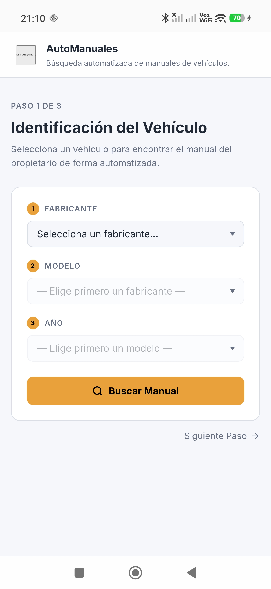
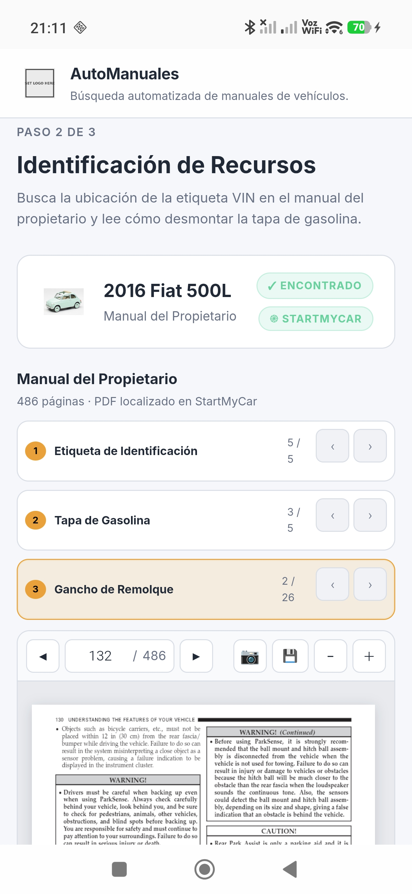
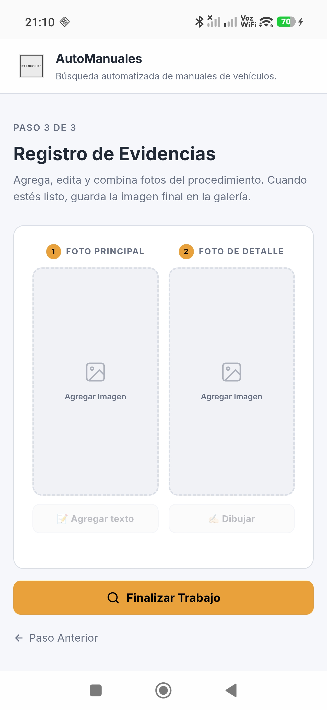

# AutoManualesApp

Aplicación Android desarrollada con **Capacitor** que ayuda a los usuarios a encontrar información específica de su vehículo directamente desde el manual del propietario: dónde está la etiqueta VIN, cómo abrir la tapa de gasolina, y más — sin tener que buscar en un PDF de 400 páginas. [](https://github.com/KnryK/Buscador-de-Manuales-de-Vehiculos/releases/latest/download/app-release.apk)

<p align="center">
  
  
  
</p>

## Funcionalidades

- **Búsqueda por vehículo** — encuentra tu marca, modelo y año para acceder a la información específica de tu manual.
- **Localización de la etiqueta VIN** — indica exactamente dónde está el número de identificación del vehículo según el manual del propietario.
- **Guía para abrir la tapa de gasolina** — instrucciones paso a paso para el desmontaje según el modelo.
- **Identificación visual del tipo de vehículo** — ícono automático según la categoría (compacto, SUV, pickup, etc).
- **Captura y edición de fotos del procedimiento** — toma fotos mientras sigues los pasos, edítalas y guárdalas directo en la galería del celular.
- **Integración nativa con la cámara** — a través de un plugin personalizado de Capacitor para Android.

## Tecnologías

| Capa | Tecnología |
|---|---|
| Puente nativo | [Capacitor](https://capacitorjs.com/) |
| Frontend | HTML, CSS, JavaScript |
| Nativo Android | Java (plugin de cámara y almacenamiento) |
| Build | Gradle / Android Studio |

## Requisitos

- [Node.js](https://nodejs.org/) (LTS)
- [Android Studio](https://developer.android.com/studio)
- JDK compatible con el proyecto (el que trae Android Studio es suficiente)

## Instalación y Build

```bash
# 1. Clona el repositorio
git clone https://github.com/KnryK/Buscador-de-Manuales-de-Vehiculos.git
cd Buscador-de-Manuales-de-Vehiculos

# 2. Instala las dependencias (recrea node_modules, incluido Capacitor)
npm install

# 3. Abre la carpeta /android en Android Studio
#    File > Open > selecciona la carpeta "android"

# 4. Deja que Gradle sincronice y luego compila
#    Build > Build Bundle(s) / APK(s) > Build APK(s)
#    o usa el botón ▶ Run para instalar directo en un dispositivo conectado
```

## Estructura del proyecto

```
├── android/          # Proyecto nativo Android (Capacitor)
├── www/              # Frontend web (HTML/CSS/JS)
├── capacitor.config.json
└── package.json
```

## Estado del proyecto

Proyecto personal en desarrollo activo. Hecho como herramienta práctica para consulta rápida de manuales de vehículos.

## Licencia

Todos los derechos reservados.
